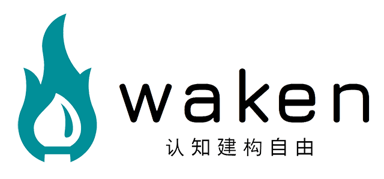

# Awaken



一个多端同步阅读软件：

1. 支持桌面（Windows、macOS、理论Linux）和移动端（安卓、iOS）。
2. 基于**WebDAV**的书籍管理，支持进度、笔记、书签同步，并且支持从**Kindle**导入笔记。
3. 仅支持**EPUB**电子书，其他的可以自行转换，例如[一键批量下载 Kindle 全部电子书工具 + 移除 DRM 解密插件 + 格式转换教程 (开源免费)](https://www.iplaysoft.com/kindle-download-dedrm.html)。

**本项目不接任何需求，但是欢迎任何BUG修复或功能性的PR，当然那种什么代码不符合你的审美改改格式、改改先进的构建工具之类的还是算了，恕我懒得处理**。

技术教程见：

[Awaken-基于Hybrid方案和WebDAV的全平台开源阅读软件](https://zhuanlan.zhihu.com/p/594798266)

功能展示见视频：

[](https://www.bilibili.com/video/BV1uD4y1j79i/)

## 应用包

1. Windows(msi)/Mac(dmg)/安卓(apk)，解压ZIP都在里面：[awaken_1.0.0.zip](https://github.com/dtysky/Awaken/files/10308780/awaken_1.0.0.zip)
2. iOS：99刀开发者账户好贵而且审核好麻烦...容我犹豫一下，需要的先自己编吧。
3. Linux：手头没Linux系统的设备，不过Linux的用户们自己编一个轻轻松松吧，加油。

## 开发

首先`Clone`整个仓库，初始化项目：

```sh
nom run init
```

接着运行开发指令：

```sh
npm run dev
```

然后查到**本机IP地址**，记`DEV_URL = ${IP}:8888`，分平台处理：

### 桌面端

在对应的操作系统上，执行一句命令即可：

```sh
npm run dev-desktop
```

但注意需要在**非虚拟机包括WSL**环境执行。

### 安卓端

用最新的**Android Studio**打开**platform/android**下的工程，然后修改`MainActivity.kt`中的字段：

```kotlin
private val host: String = "http://${DEV_URL}"
```

接着连上设备调试即可。

### iOS端

用**XCode**打开**platform/ios**下的工程，然后修改`ContentView.swift`中的字段：

```kotlin
let host: String = "http://${DEV_URL}"
```

接着连上设备调试即可。

## 测试

测试很简单，如果实在桌面端，需要你一开始选择一个空目录作为本地书籍存储，可以选择**test/client**目录，接着在主界面的**设定**中，填入以下配置：

1. 地址：http://${IP}:8889/dav/
2. 用户名：dtysky
3. 密码：114514

确认后即连接到本地调试服务器，接下来你可以在**test**目录中找到一些测试用书籍，来测试添加、删除、阅读等等功能。本地测试服务器的文件落在了**test/server/dav**下。

## 发布

发布首先要执行指令：

```sh
npm run build
```

然后分平台处理：

### 桌面端

直接执行：

```sh
npm run release-desktop
```

即可，但同样需要在**非虚拟机包括WSL**环境执行。如果只发布桌面端，也可以直接执行：

```sh
npm run release
```

产物在`platforms/desktop/target/release/bundle`中。

### 安卓端

打开项目工程，在`Build` -> `Select Build Variants`窗口，设置选择为`release`模式，然后`Build` -> `Generate Signed Build or APK`即可，可能需要重新生成签名文件。

产物在`platforms/android/app/release`中。

### iOS端

打开项目工程，构建的`schema`选择`release`即可。

## todo

1. 移动端，默认选择文本后的弹窗行为。
2. 书籍列表分页。
3. 书籍列表搜索。

## Copyright

**Copyright © 2022, 戴天宇, Tianyu Dai (dtysky < dtysky@outlook.com >). All Rights Reserved.**  
**This project is free software and released under the** [GNU Lesser General Public License (LGPL)](https://www.gnu.org/licenses/lgpl-3.0.en.html).**
